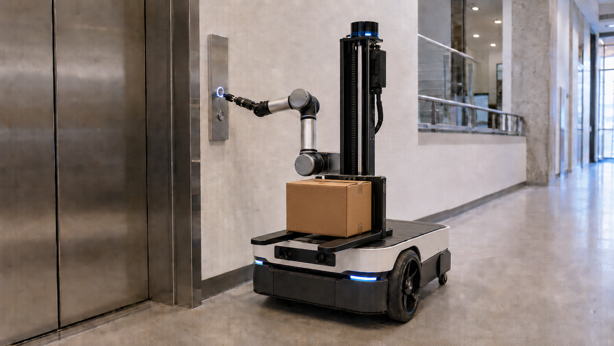
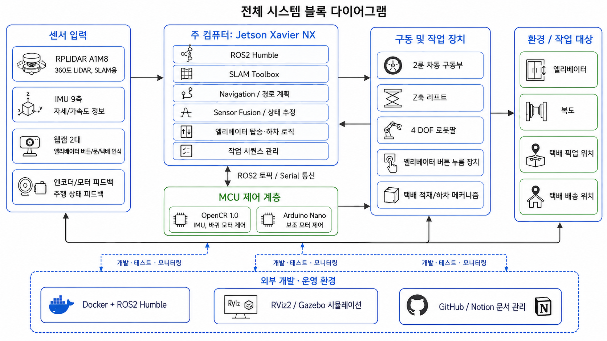

# 2026_Capstone_PackagU

## 🔖 Intro

PackagU는 **건물을 고치지 않고 엘리베이터를 타는** 실내 택배 배달 로봇입니다.
엘리베이터 제조사 API나 패널 개조 장치 없이, 4 DOF 로봇팔이 사람처럼 버튼을 눌러 층을 옮기고
소형 택배를 목적지 층까지 운반한 뒤 대기 위치로 복귀합니다.

**한 줄: "건물을 고치지 않는다. 로봇이 사람처럼 버튼을 누른다."**

## 💡 Inspiration

택배는 이미 건물 입구까지 옵니다. 그런데 받는 사람이 5층에 있으면 **마지막 몇십 미터는 결국 사람이 들고 올라갑니다.**
국내 택배 물동량은 2023년 51.58억 건에서 2025년 64.18억 건으로 늘었고, 이 반복 구간도 같이 늘었습니다.

실외 자율배송이 도로와 보도의 문제라면, 실내 배송은 **수직 공간**의 문제입니다.
바닥은 평탄하지만 엘리베이터라는 공유 설비를 써야 하고, 버튼은 사람 손을 전제로 만들어져 있습니다.

엘리베이터 API를 연동하면 성공률은 올라갑니다. 대신 제조사 협조와 건물 관리자 승인이 필요하고,
그 승인을 받은 그 건물에서만 굴러갑니다. **"승인 없이도 아무 건물에서 그대로 동작하게 할 수 없을까?"**
이 질문에서 PackagU는 버튼을 직접 누르는 쪽을 골랐습니다. 인식과 정렬이라는 어려운 문제를 저희가 떠안는 대신,
로봇이 갈 수 있는 건물의 수를 얻었습니다.

## 📸 Overview

<!-- assets/robot_concept.png ← docs/capstone/졸작이미지예상도.png -->


*로봇 외형 예상도. 하단 2륜 차동 구동부, 중앙 Z축 리프트 적재부, 상단 4 DOF 버튼 조작 팔.*

<!-- assets/system_diagram.png ← docs/졸업작품_보고서/시스템_다이어그램.png -->


*호출 수신부터 복귀까지 10단계. 아래 목록과 같은 번호를 씁니다.*

<br>

1. 1층 대기 위치에서 미션을 기다린다. (충전 스테이션 = 엘리베이터 앞)
2. 호출을 수신하면 목적지 층·호실을 미션으로 변환하고 픽업 위치로 Nav2 주행한다.
3. Z축 리프트가 상승해 소형 택배를 적재한다. 웜기어 self-locking으로 정전 시에도 내려오지 않는다.
4. 엘리베이터 패널 앞에 정렬하고, 웹캠으로 호출 버튼을 찾아 로봇팔로 누른다.
5. 문 열림을 감지하면 1.6 m × 1.6 m 칸 안으로 진입한다.
6. 목표 층 버튼을 비주얼 서보잉으로 누른다.
7. 도착을 감지하면 **해당 층 지도로 교체하고 위치 추정을 재시작**한다. (F1 → F2 world swap)
8. 배달 위치로 주행하고 리프트를 하강해 하차한다.
9. 대기 위치로 복귀한다.
10. 어느 단계든 실패하면 **재시도로 밀어붙이지 않고 정지**한 뒤 상태를 보고한다.

> 현재 **1·2·7·8·9번은 시뮬레이션에서 한 번의 명령으로 연속 동작**합니다.
> 4·5·6번(버튼 조작·문 열림 감지)은 미구현이며, 시뮬레이션에서는 엘리베이터 노드가 대신 상태를 냅니다.

## 👀 Main feature

- ### 1️⃣ 층별 지도 자동 전환 (F1 → F2 world swap)

  2D SLAM 지도는 **한 층 단위로만** 만들어집니다. 그래서 층을 옮기는 순간 로봇은 자기 위치를 잃습니다.
  Nav2의 맵만 바꾸면 `/scan`이 보는 벽과 맵이 어긋나 AMCL이 발산합니다.
  그래서 **Gazebo 건물 모델까지 같이 교체**해 `/scan`·AMCL·Nav2가 같은 층을 보게 만들었습니다.

  <!-- TODO: WITH_RVIZ=true 로 층 전환 전후를 캡처해 assets/world_swap.png 로 올린 뒤 아래 주석을 해제할 것
  
  -->

  *F1 미션 완료 → 엘리베이터 복귀 → 건물 모델 교체 → F2 배달 목표. 한 번의 스크립트로 연속 실행됩니다.*

  <br>
  <details>
    <summary>층 전환 module 상세설명 ⏬</summary>

  - **floor_map_registry**: `floor_maps.yaml`로 층 ↔ 맵 파일을 등록. 층 번호를 파일 경로로 해석하는 단일 지점.
  - **auto_switch_core**: 층 전환 상태머신. 전환 가능 여부 판정과 phase(`ready` / `pending`) 관리.
  - **auto_floor_orchestrator_node**: Nav2 `map_server` 재로드, AMCL 초기 자세 주입, 전환 완료 통보.
  - **world_swap_node**: Gazebo 엔티티 단위로 `kku_f1_building` 제거 → `kku_f2_building` 스폰.
  - **설계 변경 기록**: 처음에는 로봇을 순간이동시키는 teleport 안(A안)이었으나 `/scan`과 맵 불일치를 해결하지 못해 **건물 모델 교체 방식으로 대체**했습니다. 판단 근거는 `plan/increment_log.md`에 남아 있습니다.
  </details>

  <br>
  <details>
    <summary>검증 결과 상세설명 ⏬</summary>

  2026-06-25 구현·검증, 2026-06-29 확장 후 재검증 `[검증]`. 원커맨드 스모크의 기대 출력:

  ```text
  Goal finished with status: SUCCEEDED
  PASS world swap smoke
  status phase=ready pending=false current_floor=F2 map_loaded=true
  map width=498 height=348 origin=-2.46,-2.96
  entity kku_f2_building present
  entity kku_f1_building absent
  /scan has finite ranges
  ```

  - **"성공했다"로 끝내지 않습니다.** 새 층 엔티티가 있는지(`present`), 이전 층이 지워졌는지(`absent`), `/scan`이 유한값인지까지 스크립트가 확인하고 로그를 `verification/latest/`에 남깁니다.
  - 실행 로그가 남지 않으면 그 회차는 검증으로 치지 않습니다.
  </details>

- ### 2️⃣ 엘리베이터 배달 미션 상태머신

  주행·적재·층 이동·하차를 개별 데모로 두지 않고 **하나의 미션 트리**로 묶었습니다.
  미션은 YAML로 선언하고, 각 단계는 행동(behavior) 단위로 실행되며, 실패하면 다음 단계로 넘어가지 않습니다.

  <br>
  <details>
    <summary>미션 module 상세설명 ⏬</summary>

  - **mission_model / mission_tree**: `delivery_missions.yaml`을 미션 객체로 파싱하고 실행 순서를 트리로 구성.
  - **behaviors**: `navigate_route`, 적재/하차, 엘리베이터 대기 등 단위 행동. 각각 dry-run 테스트가 붙어 있습니다.
  - **point_registry / kku_nav_points.yaml**: 픽업존·엘리베이터 앞·호실 목표를 이름으로 등록. 좌표를 코드에 박지 않습니다.
  - **orthogonal_router**: 복도는 직교 구조인데 Nav2 기본 경로가 대각선으로 벽을 스치는 문제가 있었습니다. 복도 축을 따라 경유점을 만들어 직교 경로로 강제합니다.
  - **elevator_sim_node**: 실물 엘리베이터가 없는 단계에서 문 열림·도착 신호를 대신 발행하는 시뮬레이션 노드. **실기에서는 이 노드가 빠지고 그 자리에 센서가 들어옵니다.**
  - **capture_nav_point.py**: RViz에서 찍은 자세를 그대로 좌표로 저장하는 도구. 좌표를 손으로 옮겨 적다 생기는 오차를 없앱니다.
  </details>

- ### 3️⃣ 건물 개조 없는 버튼 직접 조작

  엘리베이터를 쓰는 방법은 셋인데, 저희는 가장 어려운 쪽을 기본안으로 택했습니다.

  | 방식 | 장점 | 한계 | 채택 |
  | --- | --- | --- | --- |
  | 엘리베이터 API · 관제 연동 | 성공률 높음, 운행 정보 활용 | 제조사·건물 승인 필요, 범용성 낮음 | 향후 확장안 |
  | 패널 부착형 누름 모듈 | 제어기 개조 없음, 반복성 높음 | 패널마다 설치·허가 필요 | 참고 기술 |
  | **로봇팔 직접 버튼 조작** | **건물 개조 최소, 어느 건물이든 동일** | 인식·정렬·팔 제어 난도 높음 | **기본 구현안** |

  선행 연구에서 AMR + eye-in-hand 로봇팔의 버튼 누름 성공률은 **평균 약 60%**로 보고됩니다.
  즉 이 방식의 병목은 팔의 힘이 아니라 **버튼 인식과 정렬 정확도**입니다.

  <br>
  <details>
    <summary>로봇팔 상세설명 ⏬</summary>

  - **구성**: 총 길이 60 cm, 엔코더 내장 360° 서보 1개 + 180° 서보 3개 (4 DOF).
  - **엔드이펙터**: 고무 팁 또는 스프링 완충 구조. **버튼을 망가뜨리지 않는 것**이 요구사항입니다.
  - **현재 상태**: `base → shoulder → elbow → wrist → end_effector` TF 정의 작업 중 `[미검증]`. TF가 서야 IK와 비주얼 서보잉이 그 위에 올라갑니다.
  - **비주얼 서보잉**: 웹캠으로 버튼 위치를 잡고 팔 자세를 보정하는 폐루프 제어. 사전 좌표 티칭 방식은 패널 위치가 조금만 달라도 실패하므로 채택하지 않았습니다.
  - **Depth 카메라 사용 여부는 미확정**입니다. 단안 웹캠만으로 정렬 정확도가 나오는지가 판단 기준입니다.
  </details>

- ### 4️⃣ 주행 구동부와 Z축 리프트

  20 kg을 싣고 평지를 달리면서 **엘리베이터 문턱 약 1 cm를 넘어야** 합니다.
  적재부는 정전이나 배터리 방전 상황에서도 택배가 내려앉지 않아야 합니다.

  <br>
  <details>
    <summary>주행부 상세설명 ⏬</summary>

  - **구조**: 2륜 차동 구동 + 볼롤러 베어링 1개. 직경 7 cm급 고무/우레탄 타이어(슬립 방지).
  - **토크 산정**: 정적 요구 약 2.4 N·m, **여유 2배 이상**을 확보하도록 모터를 선정합니다.
  - **하위 제어**: OpenCR 1.0 + Dynamixel 2륜. `LEFT_ID=1`, `RIGHT_ID=2`, `57600 bps`, Protocol 2.0, Velocity Control.
  - **오도메트리**: OpenCR 내장 9축 IMU로 자세를 보정하고, `cmd_vel` → 좌우 바퀴 각속도 변환을 펌웨어에서 처리합니다.
  - **배선·ID 설정·회전 테스트·좌우 보정 절차**는 `docs/opencr_dynamixel_wheel_test.md`에 단계별로 문서화되어 있습니다.
  - **구동 모터·배터리·DC-DC 컨버터 사양은 확정 대기** `[미확정]`. 이 결정이 URDF 관성값과 주행 시간을 동시에 묶고 있습니다.
  </details>

  <br>
  <details>
    <summary>Z축 리프트 상세설명 ⏬</summary>

  - **구동**: 웜기어 DC 모터 + T형 리드스크류. 스트로크 70 cm, 최대 하중 5 kg.
  - **self-locking을 요구사항으로 못 박았습니다.** 웜기어는 역구동이 안 되므로 전원이 끊겨도 적재물이 자중으로 내려오지 않습니다. 별도 브레이크를 달지 않아도 되는 이유입니다.
  - **가이드·케이블**: 리니어 샤프트 수직 가이드, 유연 케이블 체인으로 상하 이동 배선을 관리합니다.
  - **본체 외형은 Fusion 360 설계 완료** `[완료]`. 무게중심·관성 데이터를 URDF inertial 블록에 반영하는 작업이 연계됩니다.
  </details>

- ### 5️⃣ 개발 PC와 Jetson을 같은 컨테이너로

  Jetson Xavier NX는 **ROS2 Humble을 호스트에서 지원하지 않습니다.** 그래서 처음부터 컨테이너로 갔습니다.
  문제는 개발 PC가 amd64, Jetson이 aarch64라는 점입니다. amd64 이미지는 Jetson에서 **아예 실행되지 않습니다.**
  이걸 마지막에 발견하면 배포 단계에서 통째로 막히므로, 이미지 정의를 처음부터 두 갈래로 분리했습니다.

  <br>
  <details>
    <summary>컨테이너 · 이식성 상세설명 ⏬</summary>

  - **`docker/Dockerfile`**(개발 amd64) / **`docker/Dockerfile.jetson`**(실기 aarch64) 이중 정의.
  - **compose 3종**: `docker-compose.linux.yml` · `docker-compose.windows.yml` · `docker-compose.jetson.yml`. Windows는 VcXsrv X11 forwarding으로 GUI를 띄웁니다.
  - **`scripts/check_portability.py`**: 절대경로·호스트 종속 설정이 코드에 섞이지 않았는지 검사. 이식성을 리뷰어의 눈이 아니라 스크립트로 지킵니다.
  - **GHCR 자동 발행**: `.github/workflows/publish-ghcr.yml`로 이미지를 `ghcr.io/packagu/ros2-humble-slam`에 push.
  - **aarch64 이미지 실빌드와 Jetson 실기 검증은 남아 있습니다** `[미검증]`.
  </details>

  <br>
  <details>
    <summary>검증 자동화 상세설명 ⏬</summary>

  ```bash
  bash scripts/run_offline_tests.sh    # 호스트/CI — ROS2 없이 도는 오프라인 스위트
  ```

  - **오프라인 테스트**: launch 파이썬 문법, URDF xacro 처리, `.world` XML 적합성, RViz config 유효성, 미션/좌표 레지스트리, 층 전환 상태머신, 패키지 메타데이터 — **컨테이너 없이 호스트에서 돕니다.**
  - **컨테이너 E2E**: `run_l3_world_swap_smoke.sh`로 F1 미션 → 층 전환 → F2 배달까지 한 번에.
  - **`WITH_RVIZ=true KEEP_RUNNING=1`**로 사람이 눈으로 보는 실행도 같은 스크립트로 처리합니다. 시연용 실행과 검증용 실행이 갈라지지 않게 하기 위해서입니다.
  - **`.github/workflows/check.yml`**로 PR마다 오프라인 스위트를 돌립니다.
  </details>

## Environment

### Robotics / Middleware


### Onboard / Hardware


### Language / Tools


### Infra


## 🗂 Architecture

```text
미션 입력 (호출 신호 · 목적지 층/호실)
  └─ Jetson Xavier NX — Docker 컨테이너 (ROS2 Humble)
       ├─ elevator_mission_pkg      배달 미션 상태머신 · 행동 트리 · 좌표 레지스트리
       ├─ auto_floor_orchestrator   층 전환 판정 → map_server 재로드 → AMCL 재초기화
       ├─ slam_pkg                  SLAM Toolbox(맵 생성) / Nav2 + AMCL(저장 맵 주행)
       ├─ common_pkg                로봇 URDF · KKU 가상 건물 world (F1/F2/F3)
       ├─ drive_pkg                 teleop · cmd_vel 경로
       └─ robot_arm_pkg             4 DOF 팔 (TF 작성 중)
                    │
       ┌────────────┴──────────────────────────────────┐
   RPLiDAR A1m8                                  OpenCR 1.0 + Arduino Nano
   웹캠 x2 (버튼 인식)                             ├─ Dynamixel 2륜 차동 구동 · IMU 오도메트리
                                                  └─ Z축 리프트 (웜기어 + T스크류, self-locking)

  시뮬레이션 전용 계층 (실기에서는 빠짐)
       ├─ gazebo_world_swap_pkg     Gazebo 건물 모델 교체 (F1 ↔ F2)
       └─ elevator_sim_pkg          문 열림 · 층 도착 신호 대역
```

**SLAM 모드와 Nav2 모드를 분리해 운영합니다.** SLAM 모드로 층별 맵을 만들어 저장하고,
SLAM을 끈 뒤 `map_server + AMCL + Nav2`로 저장 맵 위에서 주행합니다. 맵을 만들면서 동시에 주행하지 않습니다.

## File Architecture

```text
PackagU
.
├─ .github/                          조직 프로필 (이 문서)
│
├─ Code_Space/                       메인 ROS2 워크스페이스
│  ├─ AGENTS.md                      사람 · AI 어시스턴트 공통 작업 규칙 (필독)
│  ├─ Roadmap/                       01 PoC → 08 안전/보안, 8단계 실행 로드맵
│  ├─ docker/
│  │  ├─ Dockerfile                  개발용 amd64
│  │  ├─ Dockerfile.jetson           실기용 aarch64
│  │  └─ compose/                    linux · windows(VcXsrv) · jetson
│  ├─ scripts/
│  │  ├─ bootstrap_workspace.sh      월드 · 맵 생성 (최초 1회)
│  │  ├─ run_kku_sim.sh              컨테이너 + Gazebo + SLAM + RViz 원커맨드
│  │  ├─ run_offline_tests.sh        오프라인 테스트 스위트 (host/CI)
│  │  ├─ generate_kku_worlds.py      건국대 신공학관 모사 F1/F2/F3 world 생성
│  │  └─ check_portability.py        호스트 종속 설정 검사
│  ├─ src/
│  │  ├─ common_pkg/                 robot.urdf.xacro · kku_f1~f3.world · gazebo.launch.py
│  │  ├─ slam_pkg/                   slam_toolbox_params.yaml · nav2_params.yaml
│  │  │  ├─ launch/                  slam_toolbox · kku_simulation · kku_navigation
│  │  │  └─ maps/kku_virtual/        f1 · f2 · f3 저장 맵
│  │  ├─ drive_pkg/                  keyboard_teleop
│  │  └─ robot_arm_pkg/              4 DOF 팔 (TF 작성 중)
│  ├─ test_workspace/
│  │  ├─ elevator_mission/           미션 트리 · 행동 · 좌표 레지스트리 · 직교 라우터
│  │  ├─ elevator_auto_map_switch/   층 ↔ 맵 레지스트리 · 전환 상태머신 · 오케스트레이터
│  │  └─ gazebo_world_swap/          Gazebo 건물 모델 교체 + E2E 스모크 + verification/
│  └─ docs/
│     ├─ hardware_spec.md            하드웨어 SSOT
│     ├─ improvement_report.md       리스크 · 개선 추적기
│     ├─ opencr_dynamixel_wheel_test.md
│     ├─ deployment/                 이식성 정책 · Jetson 배포 절차
│     └─ simulation_test/            01 환경 → 05 엘리베이터 상태머신, 단계별 실행 기록
│
├─ ros2-humble-slam-docker/          컨테이너 이미지 정의 (GHCR 발행)
├─ robot_arm/                        로봇팔 서보 제어 실험
└─ 2026_graduation_project/          기획 · 설계 문서 · 최종보고서
```

| 저장소 | 역할 |
| ---- | ---- |
| [Code_Space](https://github.com/PackagU/Code_Space) | 메인 ROS2 워크스페이스 — SLAM · Nav2 · 미션 상태머신 · 층 전환 · 시뮬레이션 |
| [ros2-humble-slam-docker](https://github.com/PackagU/ros2-humble-slam-docker) | 개발(amd64) / Jetson(aarch64) 공용 컨테이너 이미지 정의 |
| [robot_arm](https://github.com/PackagU/robot_arm) | 4 DOF 로봇팔 서보 제어 실험 |
| [2026_graduation_project](https://github.com/PackagU/2026_graduation_project) | 기획 · 하드웨어 설계 · 최종보고서 |
| [ROAD MAP 보드](https://github.com/orgs/PackagU/projects/1) | 이슈 단위 진행 추적 |

### 퀵스타트

```bash
git clone https://github.com/PackagU/Code_Space.git && cd Code_Space
bash scripts/bootstrap_workspace.sh        # 월드/맵 생성 (최초 1회)
./scripts/run_kku_sim.sh F1                # 컨테이너 + Gazebo + SLAM + RViz
```

## Video

[하드웨어 실물 사진]

[시연 영상 썸네일]

<br>

시연은 아래 8개 장면으로 구성합니다. **현재 통과 여부를 함께 적습니다.**

| # | 장면 | 검증 방법 | 상태 |
| --- | --- | --- | --- |
| 1 | 가상 건물 F1에서 SLAM 맵 생성 · 저장 | `run_kku_sim.sh F1` → 맵 저장 | `[검증]` |
| 2 | 저장 맵 위 Nav2 자율주행 (픽업 → 엘리베이터 복귀) | 목표 도달 `SUCCEEDED` | `[검증]` |
| 3 | **층 전환 — F1 건물 모델 제거 + F2 스폰 + 맵 교체** | 엔티티 present/absent + `/scan` 유한값 | `[검증]` |
| 4 | 복도 직교 경로 주행 (벽 스침 회피) | 경로 로그 + 충돌 0회 <sub>(라우터 로직 단위 테스트는 통과)</sub> | `[미검증]` |
| 5 | 실기 2륜 Dynamixel 구동 + teleop | OpenCR 통신 확인 후 회전 테스트 | `[미검증]` |
| 6 | 로봇팔 버튼 누름 (정적 위치) | 반복 20회 성공률 측정 | `[미검증]` |
| 7 | Z축 리프트 적재 · 하차 (5 kg) | 정전 시 자중 낙하 없음 확인 | `[미검증]` |
| 8 | **Jetson 실기에서 동일 컨테이너로 end-to-end** | aarch64 이미지로 1~7 재현 | `[미검증]` |

**3번이 현재 가장 강한 장면이고, 8번이 남은 관문입니다.**
3번은 컷 편집 없이 F1 미션부터 F2 도착까지 연속으로 촬영합니다.

## ⚠️ 안전 경계

**PackagU는 사람이 상주하는 공간에서 무감독으로 운용할 수 있는 상태가 아닙니다.**
현재는 시뮬레이션 검증 단계이며, 실기 투입 전에 아래 항목이 모두 닫혀야 합니다.

- **E-stop 미구현** `[미구현]` — 소프트 정지·물리 비상 정지 버튼 모두 아직 없습니다. 실기 통전 전 선행 조건입니다.
- **실제 엘리베이터 환경 미검증** — 금속 칸 내부의 LiDAR 반사 오차를 아직 측정하지 못했습니다.
- **문 열림 감지 방식 미확정** — LiDAR 거리 변화 / 카메라 / 시간 추정 중 선택 예정입니다. 시간 추정 단독은 채택하지 않습니다.
- **층수 인식 방식 미확정** — OCR / IMU 적분 / 외부 카메라 중 선택 예정. 층을 잘못 알면 배송 실패가 아니라 **미아**가 됩니다.
- **20 kg 하중 로봇이 사람 옆을 지납니다.** `collision_monitor` 도입과 동적 장애물 정지 거리 측정이 남아 있습니다.
- **로봇 단독으로 사람을 태우거나 밀지 않습니다.** 사람과 함께 엘리베이터를 탈 때의 양보 규칙도 아직 정의되지 않았습니다.
- **미검증 항목을 검증된 것처럼 표기하지 않습니다.** 이 문서의 `[검증]`은 실행 로그가 `verification/`에 남은 항목만 뜻합니다.

## 📄 제3자 라이선스

- ROS 2 Humble: Apache-2.0
- Navigation2 (Nav2): Apache-2.0
- SLAM Toolbox: LGPL-2.1
- Gazebo Classic: Apache-2.0
- DYNAMIXEL SDK: Apache-2.0
- rplidar_ros: BSD-3-Clause
- 지도 데이터는 자체 제작한 가상 건물(KKU virtual)이며 외부 지도 데이터를 포함하지 않습니다.
- 프로젝트 자체 LICENSE와 추가 의존성 고지는 공개 전환 전 확정합니다.

## Team Member

<br>

건국대학교 전기전자공학부 4학년 · 전기전자종합설계 및 소프트웨어실습 (2026) · 종설 6조

| 팀원 | 역할 |
| ---- | ---- |
| **이준형** ([@JunhyungLee25](https://github.com/JunhyungLee25)) | SLAM · Nav2 · 시뮬레이션 · 층 전환 · 인프라 |
| **한OO** ([@inonewater](https://github.com/inonewater)) | Fusion 360 모델링 · 주행 구동부 · Z축 리프트 |
| **김OO** ([@DuckFrog123](https://github.com/DuckFrog123)) | 4 DOF 로봇팔 · 비주얼 서보잉 · 컨테이너 이미지 |
